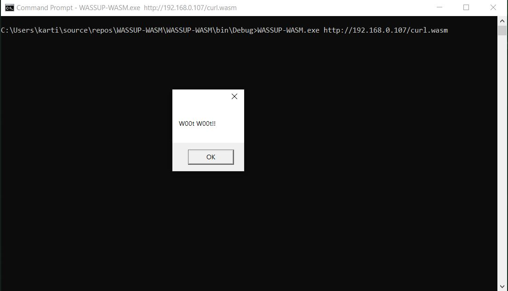

# WASSUP-WASM
"WASSUP-WASM" is a tiny application that can be used to download and execute the WebAssembly binary using Node.JS.

More info on: https://iamroot.blog/2020/06/29/webassembly-executing-malicious-code-using-system/

Note:
The JavaScript file generated by this tool executes the C/C++ code present inside the main(). In order to call the functions from JavaScript use "-s EXPORTED_FUNCTIONS" while compiling your C/C++ program and replace the base64 string with the new one.

Check: https://emscripten.org/docs/porting/connecting_cpp_and_javascript/Interacting-with-code.html#calling-compiled-c-functions-from-javascript-using-ccall-cwrap

# Usage

WASSUP-WASM <URL to download and execute .WASM file>

# References:
https://emscripten.org/index.html
